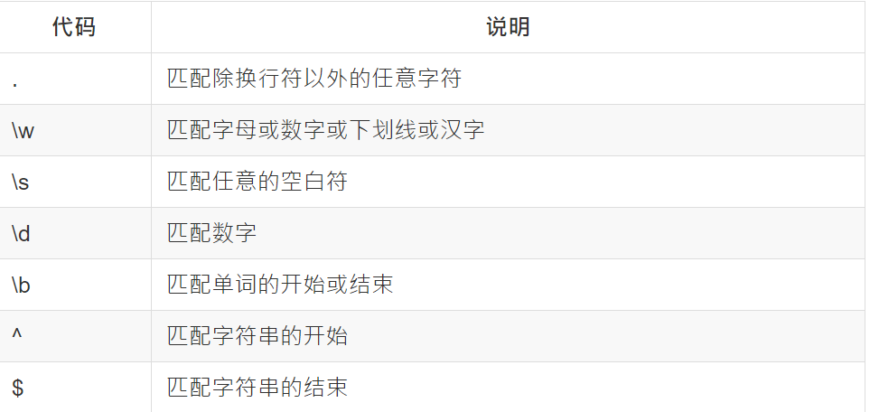
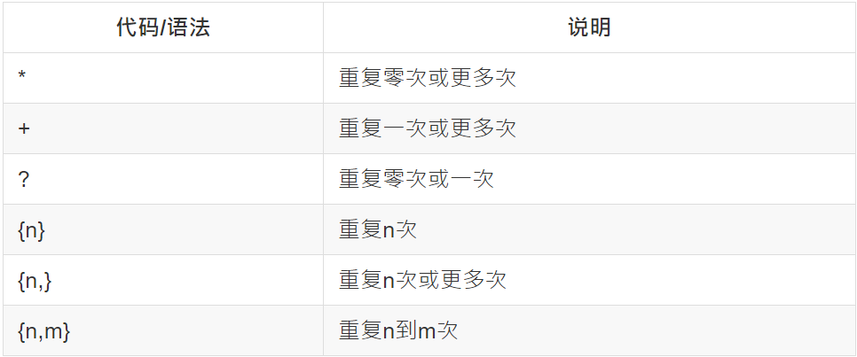
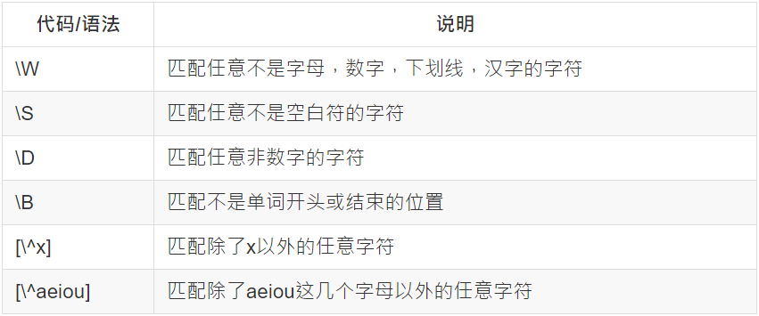

## 正则表达式

- 学习正则表达式的一些demo
- 资源
	- https://developer.mozilla.org/zh-CN/docs/Web/JavaScript/Guide/Regular_Expressions
	- https://luke0922.gitbooks.io/learnregularexpressionin30minutes/content/chapter3.html

## 0100_JSReg.js

- js中的正则表达式语法，包括RegExp和String对象

## 0200_QuickStart.js

- `\b`代表的是单词的分隔符
	```
		let str = 'hi history him hi';
		let regex = new RegExp(/\bhi\b/);
	```
- `.`匹配除了换行符以外的任意字符;`*`指定前边的内容可以连续重复使用任意次
	```
		let str2 = 'hi history him hi Lucy';
		let regex2 = new RegExp(/\bhi\b.*\bLucy\b/);
	```
- `\d`匹配一位数字;`-`只匹配它本身
	```
		let phone = '010-61593333';
		let phoneReg = new RegExp(/0\d\d-\d\d\d\d\d\d\d\d/);
	```
- `{num}`简化上面的表达式
	```
		let phoneReg2 = new RegExp(/0\d{2}-\d{8}/);
	```
- `{5,12}`表示5到12
	```
		let qqReg = new RegExp(/\d{5,12}/);
		let qq = `190978752`;
	```
- `^`表示开头;`$`表示结尾
	```
		let idReg = new RegExp(/^\d{1,5}$/);
		let id = '1';
		let notId = 'a1';
	```
- 常用的元字符
	

## 0300_Transfer.js
- 转义字符

## 重复


## 0400_Customize.js
- 可以用`[]`自定义一些匹配规则
	```
		let date = '2017-04-01';
		let date2 = '2017/04/01';
		let regex = new RegExp(/(\d{4})([-/])(\d{1,2})(\d{1,2})/);
	```
- `[]`中的特殊字符可以不转义，当然转义之后也有效果

## 0500_Or.js
- 可以在一个正则表达式中用`|`连接多个规则，这些规则中只要有一个匹配上即可
	```
		let tel = '010-61591234';
		let tel2 = '0316-3666086';
		let telReg = new RegExp(/(0\d{2}-\d{8})|0\d{3}-\d{7}/);
	```

## 反义

